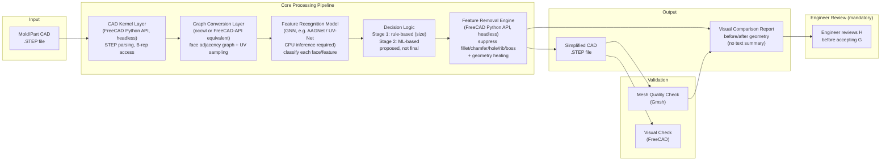
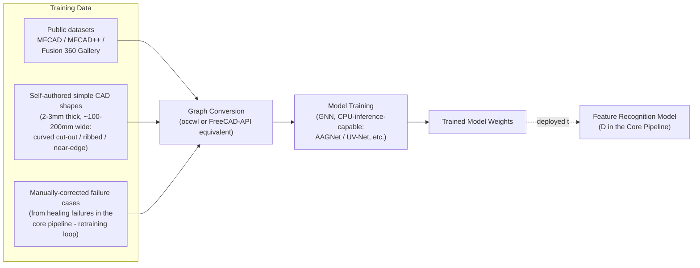

# System Architecture (W3)

> **Status: Toolchain and process confirmed** (FreeCAD Python API, headless/batch, instead of NX — validated by HP mentor Byoungho Yoo, 2026-09-18, see [step_library_comparison.md](step_library_comparison.md) §9). **Only the specific Feature Recognition Model** (UV-Net/BRepNet/AAGNet/BrepMFR) **is still open** — the mentor has no preference, it's the team's own choice.

## 1. Overall Pipeline

The tool only *proposes* a defeatured result — it does not auto-finalize. Every result goes through **mandatory engineer review** via the visual comparison report (H) before being accepted; this applies to all results, not just low-confidence ones.

**Decision Logic is staged, not a single model**: Stage 1 is rule-based (e.g., remove features below a size threshold), Stage 2 is ML-based. Cases where the pipeline's proposal is wrong or healing fails are corrected manually and fed back into Stage 2's training set — see the retraining loop (K3) in the training pipeline below.

## 2. Offline: Model Training Pipeline

The Feature Recognition Model is trained and deployed ahead of time, separately from the pipeline above. Training may use a GPU server (e.g. the team's AI Lab RTX 5090 server); the deployed model must still run inference on a **GPU-less office laptop** at runtime (see §4).

## 3. Layer Descriptions

| Layer | Component | Responsibility |
|---|---|---|
| Input | STEP file | Original CAD provided by the user/HP |
| CAD Kernel | FreeCAD Python API, run headless/standalone (cadquery optional, STEP-generation only) | Parse STEP, access face/edge/vertex, execute the final shape manipulation (feature removal) |
| Graph Conversion | occwl or a FreeCAD-API-based equivalent (re-check needed, see step_library_comparison.md §7) | Convert B-rep into a face adjacency graph + UV parameter samples (model input format) |
| Feature Recognition Model | GNN-family model (candidates: UV-Net/BRepNet/AAGNet/BrepMFR — team's choice, must run on CPU at inference) | Classify each face/feature as hole/fillet/chamfer/rib/boss, etc., and whether it has a large or small impact on defeaturing accuracy |
| Decision Logic | Staged: Stage 1 rule-based (by size), Stage 2 ML-based | Proposes whether a feature can be removed — this is a *proposal*, not a final decision. Cases it gets wrong are corrected manually and fed back into Stage 2 training |
| Feature Removal Engine | FreeCAD Python API, headless | Suppress/remove proposed features, then run geometry healing to repair the resulting shape into a valid, watertight model. On healing failure, store the geometry + failed face ID for manual correction and retraining |
| Output | Simplified STEP + visual comparison report | Deliverable presented to the engineer; no text summary, only a before/after visual |
| Engineer Review | Human (mandatory) | Reviews the visual comparison report and accepts/rejects the result before it is finalized — this applies to every run, since the tool is a decision-support aid, not a fully autonomous replacement |
| Validation | Gmsh (mesh quality), FreeCAD (visual) | Compare before/after simplification; success is measured by **defeaturing accuracy**, not downstream CAE analysis accuracy (explicitly out of scope) |

## 4. Confirmed Decisions

- [x] **CAD toolchain: FreeCAD Python API, run headless/standalone (batch), instead of NX.** Confirmed 2026-09-18 — resolves the earlier discrepancy between the mentor's slide ("FreeCAD-python API"), the school's server guide ("cadquery"), and our own research recommendation (pythonocc-core). cadquery may optionally be used, but only for STEP generation. See [step_library_comparison.md](step_library_comparison.md) §9.
- [x] **Visual verification: FreeCAD.** Same role as originally proposed.
- [x] **NX support is not required.** The project can proceed entirely without NX CAD access.
- [x] **Training/test data will not come from HP.** HP's real CAD data is confidential and cannot be shared. The team authors simple CAD shapes itself (2-3mm thick, ~100-200mm wide; curved cut-out / ribbed / near-edge types) plus public datasets (MFCAD/MFCAD++/Fusion 360 Gallery).
- [x] **STEP is the only supported format.** NX-format support is out of scope entirely (not just deprioritized).
- [x] **Comparison report is visual only.** No text summary is required.
- [x] **Engineer review is mandatory for every result**, not just low-confidence ones.
- [x] **Deployment: inference runs on a GPU-less office laptop; training may use a GPU server.** Confirmed 2026-09-18 — constrains the feature recognition model to one with practical CPU inference.
- [x] **Success criteria: defeaturing accuracy is the top priority; downstream CAE analysis accuracy (stress/deformation) is explicitly out of scope**, not measured.
- [x] **Decision Logic is staged** (rule-based first, then ML-based), with failure cases manually corrected and looped back into training — not a single one-shot model.
- [x] **Feature recognition model: the team's own choice.** Confirmed 2026-09-18 — the mentor has no preference among UV-Net/BRepNet/AAGNet/BrepMFR.

## 5. Open Points (needs team discussion/approval)

- [ ] Pick the specific Feature Recognition Model among the candidates (UV-Net vs. BRepNet vs. AAGNet vs. BrepMFR), now that it's confirmed to be the team's own decision — weigh CPU-inference feasibility heavily given the deployment constraint.
- [ ] Re-evaluate occwl now that the confirmed toolchain is FreeCAD-python API rather than pythonocc-core (see step_library_comparison.md §7)
- [ ] Whether a web demo/UI is needed and in what form (currently assuming a batch/CLI pipeline only)

## Related Documents
- [STEP Library Comparison](step_library_comparison.md)
- [Team R&R](team_rnr.md)
- [Project Proposal Draft](project_proposal_draft.md)
