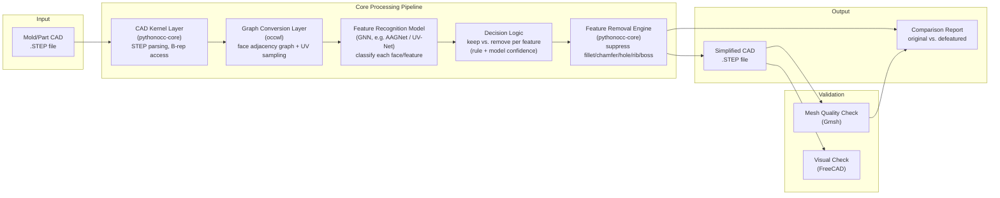
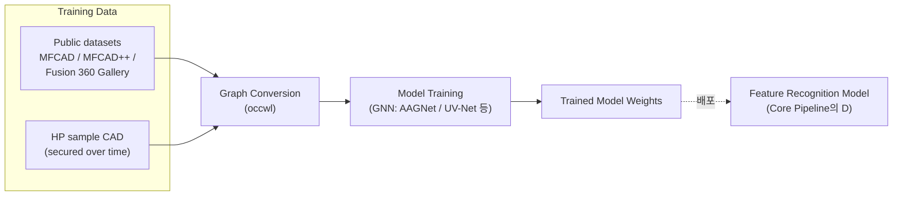

# System Architecture (Draft — W3)

> **상태: 초안, 승인 대기.** 아래 아키텍처는 [step_library_comparison.md](step_library_comparison.md)에서 조사한 추천 스택을 기준으로 그린 것이며, 팀장(사용자) 승인 후 확정한다.

## 1. 전체 파이프라인

## 2. Offline: 모델 학습 파이프라인

Feature Recognition Model은 위 파이프라인과 별도로, 사전에 학습되어 배포된다.

## 3. 레이어별 설명

| 레이어 | 구성요소 | 책임 |
|---|---|---|
| Input | STEP 파일 | 사용자/HP가 제공하는 원본 CAD |
| CAD Kernel | pythonocc-core | STEP 파싱, face/edge/vertex 단위 접근, 최종 형상 조작(피처 제거) 실행 |
| Graph Conversion | occwl | B-rep을 face adjacency graph + UV 파라미터 샘플로 변환 (모델 입력 형식) |
| Feature Recognition Model | GNN 계열 모델 (후보: UV-Net/BRepNet/AAGNet/BrepMFR) | 각 face/feature가 hole/fillet/chamfer/rib/boss 등 어떤 유형이며, 해석에 미치는 영향이 큰지/작은지 분류 |
| Decision Logic | 규칙 + 모델 confidence 결합 | 모델 출력을 바탕으로 "제거 가능" 여부 최종 판단 (초기엔 규칙 기반, 이후 학습 기반으로 고도화) |
| Feature Removal Engine | pythonocc-core (BRepFilletAPI, ShapeUpgrade 등) | 제거 대상으로 판단된 피처를 실제로 CAD에서 suppress/제거 |
| Output | 단순화 STEP + 비교 리포트 | 최종 산출물 |
| Validation | Gmsh(메쉬 품질), FreeCAD(육안) | 단순화 전후 비교, 성공 기준(70~90% 전처리 시간 절감) 검증 |

## 4. Open Points (팀 논의/승인 필요)

- [ ] Feature Recognition Model 후보 중 최종 채택 모델 결정 (UV-Net vs BRepNet vs AAGNet vs BrepMFR) — 상세 비교는 아래 "기술 스택 선정 근거" 참고
- [ ] Decision Logic을 규칙 기반으로 시작할지, 처음부터 학습 기반으로 갈지
- [ ] 웹 데모/UI 필요 여부 및 형태 (현재는 배치/CLI 파이프라인만 가정)
- [ ] HP 실데이터 확보 시점에 따라 학습 파이프라인 일정 조정

## 관련 문서
- [STEP 라이브러리 비교조사](step_library_comparison.md)
- [Team R&R](team_rnr.md)
- [프로젝트 제안서 초안](project_proposal_draft.md)
