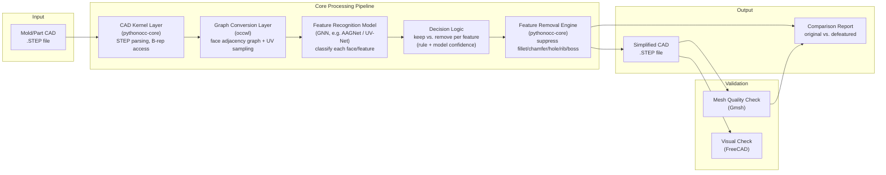
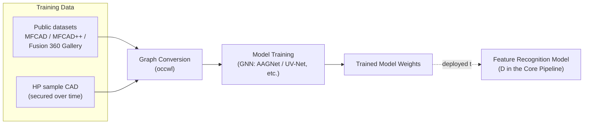

# System Architecture (Draft — W3)

> **Status: draft, pending approval.** The architecture below is drawn from the recommended tech stack researched in [step_library_comparison.md](step_library_comparison.md), and will be finalized after the team lead's approval.

## 1. Overall Pipeline

## 2. Offline: Model Training Pipeline

The Feature Recognition Model is trained and deployed ahead of time, separately from the pipeline above.

## 3. Layer Descriptions

| Layer | Component | Responsibility |
|---|---|---|
| Input | STEP file | Original CAD provided by the user/HP |
| CAD Kernel | pythonocc-core | Parse STEP, access face/edge/vertex, execute the final shape manipulation (feature removal) |
| Graph Conversion | occwl | Convert B-rep into a face adjacency graph + UV parameter samples (model input format) |
| Feature Recognition Model | GNN-family model (candidates: UV-Net/BRepNet/AAGNet/BrepMFR) | Classify each face/feature as hole/fillet/chamfer/rib/boss, etc., and whether it has a large or small impact on analysis |
| Decision Logic | Rules + model confidence combined | Final judgment on whether a feature can be removed, based on model output (start rule-based, evolve toward learning-based) |
| Feature Removal Engine | pythonocc-core (BRepFilletAPI, ShapeUpgrade, etc.) | Actually suppress/remove features judged removable |
| Output | Simplified STEP + comparison report | Final deliverable |
| Validation | Gmsh (mesh quality), FreeCAD (visual) | Compare before/after simplification, verify success criteria (70–90% preprocessing time reduction) |

## 4. Open Points (needs team discussion/approval)

- [ ] Decide the final Feature Recognition Model among the candidates (UV-Net vs. BRepNet vs. AAGNet vs. BrepMFR) — see the detailed comparison in the "tech stack rationale" discussion
- [ ] Whether to start the Decision Logic as rule-based or go learning-based from the start
- [ ] Whether a web demo/UI is needed and in what form (currently assuming a batch/CLI pipeline only)
- [ ] Adjust the training pipeline schedule depending on when HP's real data becomes available

## Related Documents
- [STEP Library Comparison](step_library_comparison.md)
- [Team R&R](team_rnr.md)
- [Project Proposal Draft](project_proposal_draft.md)
