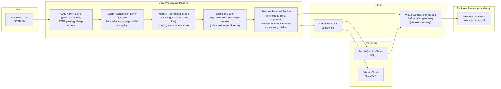
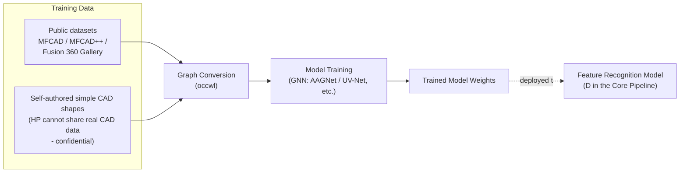

# System Architecture (W3)

> **Status: CAD kernel layer confirmed** (pythonocc-core/OCCT + FreeCAD — validated by HP mentor Byoungho Yoo, 2026-09, see [step_library_comparison.md](step_library_comparison.md) §8). **Feature Recognition Model and Decision Logic still open**, pending team discussion.

## 1. Overall Pipeline

The tool only *proposes* a defeatured result — it does not auto-finalize. Every result goes through **mandatory engineer review** via the visual comparison report (H) before being accepted; this applies to all results, not just low-confidence ones.

## 2. Offline: Model Training Pipeline

The Feature Recognition Model is trained and deployed ahead of time, separately from the pipeline above.

## 3. Layer Descriptions

| Layer | Component | Responsibility |
|---|---|---|
| Input | STEP file | Original CAD provided by the user/HP |
| CAD Kernel | pythonocc-core | Parse STEP, access face/edge/vertex, execute the final shape manipulation (feature removal) |
| Graph Conversion | occwl | Convert B-rep into a face adjacency graph + UV parameter samples (model input format) |
| Feature Recognition Model | GNN-family model (candidates: UV-Net/BRepNet/AAGNet/BrepMFR) | Classify each face/feature as hole/fillet/chamfer/rib/boss, etc., and whether it has a large or small impact on analysis |
| Decision Logic | Rules + model confidence combined | Proposes whether a feature can be removed, based on model output (start rule-based, evolve toward learning-based) — this is a *proposal*, not a final decision |
| Feature Removal Engine | pythonocc-core (BRepFilletAPI, ShapeUpgrade, etc.) | Suppress/remove proposed features, then run geometry healing to repair the resulting shape into a valid, watertight model |
| Output | Simplified STEP + visual comparison report | Deliverable presented to the engineer; no text summary, only a before/after visual |
| Engineer Review | Human (mandatory) | Reviews the visual comparison report and accepts/rejects the result before it is finalized — this applies to every run, since the tool is a decision-support aid, not a fully autonomous replacement |
| Validation | Gmsh (mesh quality), FreeCAD (visual) | Compare before/after simplification, verify success criteria (70–90% preprocessing time reduction) |

## 4. Confirmed Decisions

- [x] **CAD kernel: pythonocc-core (OCCT) for STEP I/O and feature manipulation.** Confirmed 2026-09 — HP mentor Byoungho Yoo reviewed the NX license constraint and independently validated that OCCT can replace NX for geometry creation and defeaturing, with a working preliminary test.
- [x] **Visual verification: FreeCAD.** Confirmed alongside the above — same role as originally proposed.
- [x] **NX support is not required.** The project can proceed entirely without NX CAD access.
- [x] **Training/test data will not come from HP.** HP's real CAD data is confidential and cannot be shared. Instead, the team will author simple CAD shapes themselves (plus public datasets like MFCAD/MFCAD++/Fusion 360 Gallery) for training and validation.
- [x] **STEP is the only supported format.** NX-format support is out of scope entirely (not just deprioritized).
- [x] **Comparison report is visual only.** No text summary is required — the report shows a before/after rendering of the geometry.
- [x] **Engineer review is mandatory for every result**, not just low-confidence ones. The system is a decision-support tool that speeds up the engineer's work; it does not auto-finalize a result on its own. This resolves the earlier open question about handling model uncertainty — since every result is reviewed anyway, there's no need for separate confidence-threshold logic to decide *when* to involve a human.

## 5. Open Points (needs team discussion/approval)

- [ ] Decide the final Feature Recognition Model among the candidates (UV-Net vs. BRepNet vs. AAGNet vs. BrepMFR) — see the detailed comparison in [step_library_comparison.md](step_library_comparison.md). HP mentor also flagged this as the next challenge: selecting which features to defeature, likely via AI-based training.
- [ ] Whether to start the Decision Logic as rule-based or go learning-based from the start
- [ ] Whether a web demo/UI is needed and in what form (currently assuming a batch/CLI pipeline only)

## Related Documents
- [STEP Library Comparison](step_library_comparison.md)
- [Team R&R](team_rnr.md)
- [Project Proposal Draft](project_proposal_draft.md)
